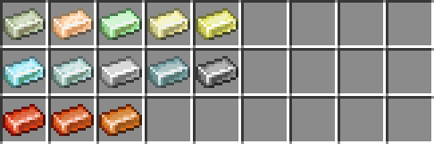
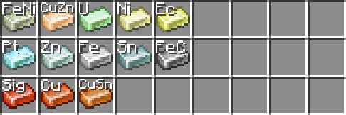
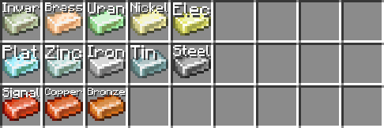
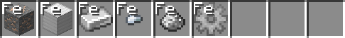

= AccessibilityMod

This mod aims to provide some features to make certain aspects of (modded) Minecraft more accessible.

== Item Overlay

In modded minecraft you often end up with a lot of similar looking items. One of the primary examples of this is the
multitude of ingots often present in larger mods/modpacks. I often find it becomes hard to tell these apart at a glance,
leading to me hovering over a lot of them to find what I'm looking for every time I open a chest.

In an effort to fix this, this mod allows you to render text over items. This is a two-step process, where it first
attempts to determine the material of an item (for example, a gold ingot and a gold block both have `gold` as material),
which is then mapped to text to be displayed. If no text is configured for the given material, no text is displayed, so
you can limit it to only the cases you find useful.

.Can you tell which is which at a glance? I cannot.

.Now I can!

.The names can be customized.

.Works on more than just ingots.

